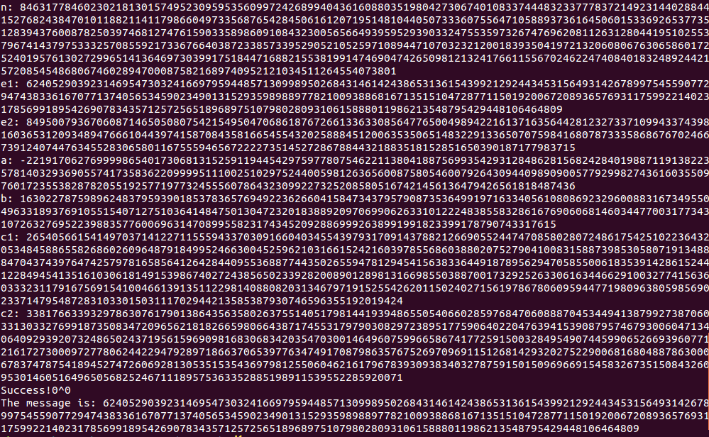
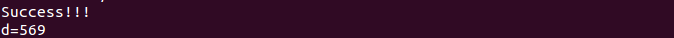

# Implementation and attack of RSA algorithm based on GMP library

## Desciption

This experiment need to do these things:

- Install the GMP library
- Implementation of RSA algorithm
- Achive the attack of RSA algorithm

## Environment

Ubuntu 14.04 LTS 32bit

## Install

- In order to make the program work with no panic,you need to install g++, gcc, m4 firstly. Like this:

		sudo apt-get install g++ gcc m4

- Then, get the [package of GMP library](GMP/gmp-6.0.0a.tar.bz2). If you come into contact for the first time with this library, [here](GMP/GMP_Chinese_Introduction_3.pdf) is a Chinese Introduction book about it.You can download it and read.
- Next step, install the GMP library, do like this:

    	tar jxvf gmp-6.0.0a.tar.bz2
    	cd gmp-6.0.0
		./configure
    	make
		make check
		make install

- OK, that is enough.
- If you want to compile the source code file and run it, do:

		gcc -W example.c -o example -lgmp
    	./example

## Attack methods

### 1

Assume the message to be encrypted can be divided into two digital m1, m2. That is to say, message = m1 * m2.

If the message can reache the maximum value of `2^length`, we can enumeration values from 1 to `2^(length/2)`.

Include these files:

- [RSA.c](RSA.c) Implementation of RSA algorithm.

- [RSA_GenerateCipherTextTable.c](RSA_GenerateCipherTextTable.c) Choose a set of key, generate a couple cipher text table.Run it like this:

	gcc -W RSA_GenerateCipherTextTable.c -o 1 -lgmp 
    ./1 > tableCipherText1
	./1 > tableCipherText2

- [RSA_Attack_01.c](RSA_Attack_01.c) Achieve the attack of RSA algorithm. Need a couple support files, tableCipherText1 and tableCipherText2.

### 2

Assume:
	C1 = me mod n1,
	C2 = me mod n2,
	...,
	Ct = me mod nt,

And `t>e`.That we can get the value of me mod(n1n2...nt) by Chinese remainder theorem.The details are as follows:

me≡∑NiNi-1Ci mod N(i:=1...t)  
N=n1n2...nt  
Ni=N/ni  
NiNi-1≡1 mod ni

Because of `t>e && m<n`  me mod(n1n2...nt) equals me, then we can get m easily.

Include these files:

- [RSAFor02.c](RSAFor02.c) generate a set of Ct, By using redirection, origin data is stored in file [result](result).

- [table_C](table_C),[table_D](table_D),[table_N](table_N),[table_E](table_E),[table_M](table_M) Record the value of C,D, N, E,M

- [RSA_Attack_02.c](RSA_Attack_02.c) Details for attacking process.

### 3 Common mode attack

Assume that there are 2 users use the same modulus n, but they use different E and D, the attacker send the same message to them.That is:
c1=me1 mod n, c2=me2 mod n.

Target: get m;

gcd(e1,e2)=1  
a\*e1+b\*e2=1  
c1a\*c2b=m mod n

Include these files:

- [RSA_Attack_03.c](RSA_Attack_03.c) Details for attacking process.

### 4 Wiener's attack

[Full details is here.](http://en.wikipedia.org/wiki/Wiener%27s_attack)

Include these files:

- [RSA_Attack_04.c](RSA_Attack_04.c) Details for attacking process.

